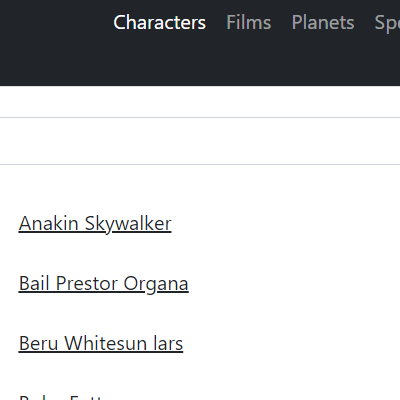

# Star Wars

View details about Star Wars characters, films, planets, species, starships, and vehicles.

## Getting Started

1. Clone the repo  
  `git clone https://github.com/nightwolfdev/starwars.git`
2. Navigate to the project folder  
  `cd starwars`
3. Install dependencies  
  `npm install`
4. Run the app  
  `ng serve`
5. Visit the app in a browser  
  `http://localhost:4200`

## Links

* [Demo](https://nightwolf.dev/demos/starwars)
* [Angular](https://angular.io)
* [Bootstrap](https://getbootstrap.com)
* [RxJS](https://rxjs.dev)
* [TypeScript](https://www.typescriptlang.org)
* [Star Wars API](https://swapi.dev)
